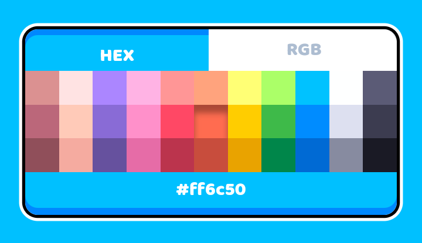

# ColorPicker

> with 4 different type 
> * HEX
> * RGB
> * Skibidi hex (S000)
> * language (ひはまやの佐々木ができますので。。をした。。を、、とのち!　ちちち　み　やぬ　ひめ)

Created With Javascript
# Palette Exporter
> Can export palette in 4 type 
> * .Pal
> * .Hex
> * .Gpl
> * .Txt
# Whats New
- Added Button Sounds
- Added Palette Export
- Added Ui Border
- Fixed Ui

# License

see the license
